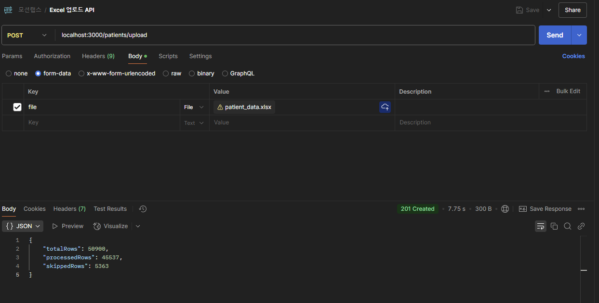
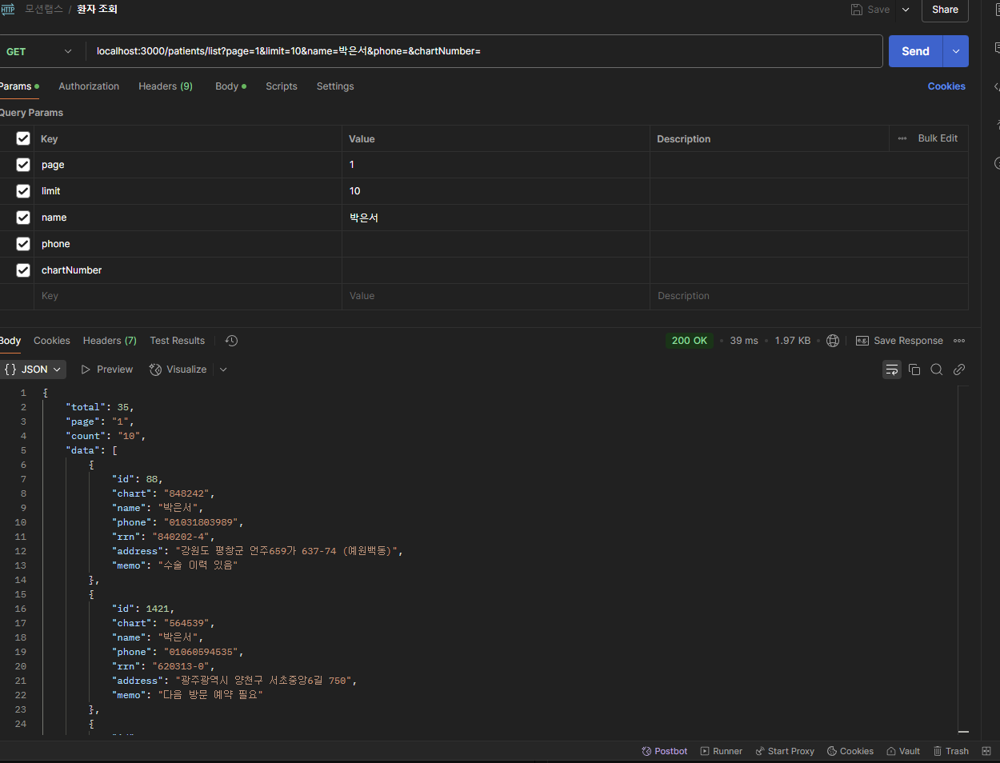

## 프로젝트 소개
🏥 환자 관리 API 프로젝트

## ✨ 요구 사항

1.  ✅ Excel 파일 업로드를 통한 환자 등록 API
2.  ✅ 환자 목록 조회 API

## 🚀 설치 및 실행 방법

1. **데이터베이스 생성** 💾 
   *(아래 설정으로 데이터베이스를 생성해주세요)*

   ```sql
   type: 'mysql',
   host: 'localhost',
   port: 3306,
   username: 'root',
   password: 'lcm1234',
   database: 'motionlabs'
   ```
2. **프로젝트 설치**  💻
   
   ```bash
   # 저장소 클론 이후 프로젝트 디렉토리로 이동
   cd project

   # 의존성 설치
   npm install

   # 환경 설정 테스트 용이를 위하여 X
   ```

3. **어플리케이션 실행**  ▶️

   ```bash
   npm run start
   ```

## 프로젝트 디렉토리 구조 
```
project/
├── src/
│   ├── common/
│   │   └── patient.vaildation.ts
│   ├── config/
│   │   └── typeorm.config.ts
│   ├── interfaces/
│   │   └── patient.interface.ts
│   ├── modules/
│   │   └── patients/
│   │       ├── dtos/
│   │       │   └── upload-excel.dto.ts
│   │       ├── patient.controller.ts
│   │       ├── patient.entity.ts
│   │       ├── patient.module.ts
│   │       ├── patient.repository.ts
│   │       └── patient.service.ts
│   ├── utils/
│   │   ├── excel.processor.ts
│   │   └── patient.util.ts
│   ├── app.module.ts
│   └── main.ts
├── test/
├── jest.config.js
├── package.json
└── README.md
```

## 💾 데이터 베이스 설계

### 환자(patients) 테이블

| 필드명      | 데이터 타입     | 제약 조건          | 설명                 |
| ----------- | --------------- | ------------------ | -------------------- |
| `id`        | `INT`           | `PK`, `AUTO_INCREMENT` | 환자 고유 식별자     |
| `chart`     | `VARCHAR(255)`  | `NULLABLE`         | 차트 번호            |
| `name`      | `VARCHAR(255)`  | `NOT NULL`         | 환자 이름            |
| `phone`     | `VARCHAR(11)`   | `NULLABLE`         | 전화번호 ('-' 제외) |
| `rrn`       | `VARCHAR(9)`    | `NOT NULL`         | 주민등록번호 (앞자리+뒷자리첫번째) |
| `address`   | `VARCHAR(255)`  | `NULLABLE`         | 주소                 |
| `memo`      | `VARCHAR(255)`  | `NULLABLE`         | 메모                 |

**💡 설계 근거:**

* `name`: 환자 식별의 필수 정보이므로 `NOT NULL` 제약 조건을 설정했습니다. (1글자 이상)
* `rrn`: 2024년 이후 건강보험 적용 시 본인 확인이 강화되어 필수 정보로 간주, `NOT NULL` 제약 조건을 설정했습니다.


## Swagger API 문서
```bash
http://localhost:3000/api-docs
```

## API 실행 예시

### 환자 등록


### 환자 목록 조회


## 성능 
Excel 50900 건 (테스트 데이터)
데이터 정제 및 병합 시간 + DB INSERT 시간(1.5초 내외) -> 3.2초 소요

단 5만건의 데이터가 전부 DB에 존재하여 Update 로직을 거치게 되면 
2~3배 시간이 소요

## ⚠️ 이슈사항

* **NestJS & TypeORM 버전 호환성**: 초기에는 NestJS Core v9.2 사용을 고려했으나, 과제 요구사항인 `TypeORM ^0.3.10`과의 호환성을 위해 NestJS 버전을 **v10.0.0**으로 상향 조정하여 프로젝트를 구성했습니다.


**Type:**

* `feat` ✨: 새로운 기능 추가
* `fix` 🐛: 버그 수정
* `docs` 📚: 문서 수정 (README 등)
* `style` 🎨: 코드 포맷팅, 세미콜론 누락 등 (코드 로직 변경 없음)
* `refactor` ♻️: 코드 리팩토링 (기능 변경 없이 코드 구조 개선)
* `test` ✅: 테스트 코드 추가 또는 수정
* `chore` ⚙️: 빌드 프로세스, 패키지 매니저 설정 등 (소스 코드 변경 없음)